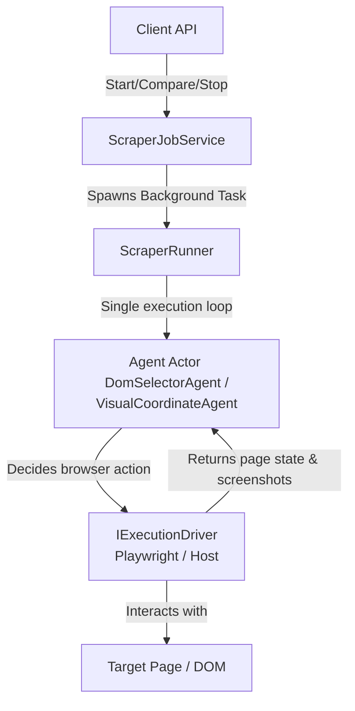

# C# Playwright Agentic Scraper

A standalone, containerized, REST-API-driven web scraper microservice written in C# targeting **.NET 10**. 

The microservice automates browser interaction and extracts structured data from dynamic websites using a **Single-Loop Agentic Architecture**. It leverages Playwright for headless automation and LLM completions to decide real-time browser actions (clicking, typing, scrolling, waiting) to accomplish a user's goal.

---

## 🏗️ Architecture



### Key Components
1. **`IExecutionDriver`**: Defines the interface for interacting with the environment (clicking, typing, scrolling, taking screenshots).
   * `PlaywrightBrowserDriver` (Default): Container-isolated headless Chromium browser connected over CDP.
2. **`IInnerLoopAgent`**: Represents the decision-making brain of the crawler.
   * `DomSelectorAgent` (Default): Evaluates a simplified XML representation of visible page elements with unique `pg-id`s. Highly reliable and token-efficient.
   * `VisualCoordinateAgent`: Operates on raw screenshots and predicts precise pixel coordinates `(x, y)` to click or interact with.
3. **`SearxngClient`**: Direct integration with the local SearXNG service to perform dynamic product/store URL discovery.

---

## 🚦 API Endpoints

### 1. Start Single Scrape Job
* **Endpoint:** `POST /api/scrape/start`
* **Body:**
  ```json
  {
    "url": "https://news.ycombinator.com",
    "goal": "Extract the top 5 article titles and points",
    "model": "gemini-2.5-flash",
    "maxSteps": 10,
    "driverType": "playwright",
    "agentType": "dom"
  }
  ```
* **Response (202 Accepted):**
  ```json
  {
    "jobId": "3fa85f64-5717-4562-b3fc-2c963f66afa6",
    "status": "Running",
    "message": "Scraping job enqueued."
  }
  ```

### 2. Check Job Status & Result
* **Status Endpoint:** `GET /api/scrape/status/{jobId}`
* **Result Endpoint:** `GET /api/scrape/result/{jobId}`
* **Logs & Screenshots:** `GET /api/scrape/logs/{jobId}`
  * *Note:* You can render the screenshots in real-time in any UI by requesting `http://localhost:8428/screenshots/{jobId}/step_{stepNumber}.png`.

### 3. Parallel Comparison (Explicit URLs)
Spawns concurrent scraper runs for a set of known URLs, running them simultaneously in isolated browser contexts.
* **Endpoint:** `POST /api/scrape/compare[?sync=true]`
* **Body:**
  ```json
  {
    "urls": [
      "https://www.target.com/p/huy-fong-sriracha-hot-chili-sauce-17oz/-/A-13473417",
      "https://www.meijer.com/shopping/product/huy-fong-sriracha-chili-sauce-17-oz/3989610189.html"
    ],
    "goal": "Find and extract the product name, price, and store availability.",
    "model": "gemini-2.5-flash",
    "maxSteps": 5
  }
  ```
* **Query Params:** `sync=true` blocks the HTTP request and returns the compiled price comparison grid once all jobs finish. Leaving it out returns immediately with a `compareId`.

### 4. Dynamic Auto-Discovery & Compare
The orchestrator uses the LLM to analyze your product query and location, determines the best search query and retailer domains (e.g. grocery domains for foods, electronics domains for headphones), searches SearXNG, spawns parallel crawls, and aggregates results.
* **Endpoint:** `POST /api/scrape/discover-compare[?sync=true]`
* **Body:**
  ```json
  {
    "query": "Huy Fong Sriracha 17oz",
    "location": "Schaumburg, IL",
    "model": "gemini-2.5-flash",
    "maxSteps": 5
  }
  ```

---

## 🛠️ Build & Run

### Locally (with .NET 10 SDK)
1. Build the application:
   ```bash
   dotnet build
   ```
2. Install Playwright browser dependencies:
   ```bash
   dotnet tool install --global Microsoft.Playwright.CLI
   playwright install
   ```
3. Start the service:
   ```bash
   dotnet run
   ```

### Docker
Start the service via Docker Compose (maps port `8428`):
```bash
docker compose up --build -d
```
