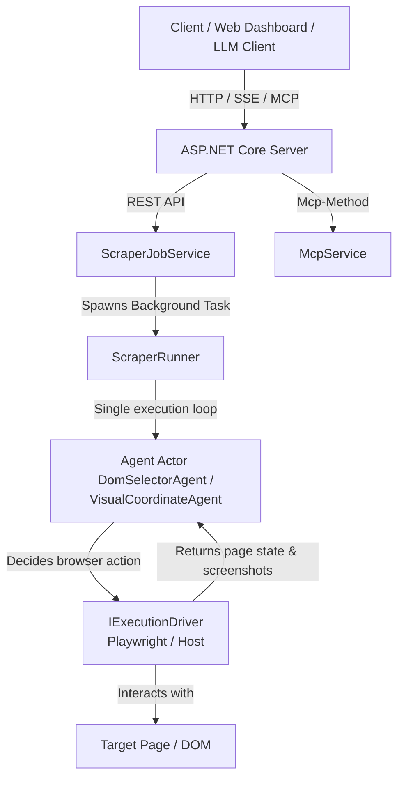

# C# Playwright Agentic Scraper

A standalone, containerized, REST-API and MCP-driven web scraper microservice written in C# targeting **.NET 10**. 

The microservice automates browser interaction and extracts structured data from dynamic websites using a **Single-Loop Agentic Architecture**. It leverages Playwright for headless automation and LLM completions to decide real-time browser actions (clicking, typing, scrolling, waiting) to accomplish a user's goal.

---

### 🌟 Key Features (v0.2.0)
- **Embedded Web Dashboard**: Access `http://localhost:8428` in your browser to visually launch jobs, inspect real-time progress bars, view step-by-step reasoning logs, preview live page screenshots, and test MCP capabilities interactively.
- **MCP Server Protocol (2026-07-28 RC Spec)**: Complete Model Context Protocol implementation supporting stateless HTTP requests (`Mcp-Method`), `server/discover`, **Tools**, **Prompts** (`prompts/list`, `prompts/get`), **Resources** (`scraper://jobs/{jobId}`, `scraper://jobs/{jobId}/logs`, `scraper://jobs/{jobId}/screenshots/{stepNumber}`), **Tasks Extension** (`tasks/get`, `tasks/cancel`), and **Argument Completions** (`completion/complete`).

---

## 💻 Web Dashboard (`http://localhost:8428`)

The microservice includes an embedded, dark-themed Single Page Application (SPA) served directly from ASP.NET Core (`wwwroot`).

### Features:
1. **Quick Job Launcher**:
   - **Single Scrape**: Form interface to trigger single-target scrapes with custom goals, model choice (`gemini-3.5-flash`, `gpt-4o`, `claude-3-5-sonnet`), max steps, and agent selector mode (`DOM` vs `Visual`).
   - **Parallel Comparison**: Form interface to trigger multi-URL concurrent scrapes.
   - **SearXNG Auto-Discovery**: Form interface for product query search & comparative extraction.
2. **Active & Recent Jobs Table**:
   - Real-time job status table (`Queued`, `Running`, `Completed`, `Failed`, `Stopped`), step counter, token usage metrics, and single-click inspection buttons.
3. **Live Job Monitor Drawer**:
   - Step progress bar and real-time execution log timeline (displaying LLM reasoning `thought`, browser `action`, and timestamps).
   - **Live Screenshot Preview**: Displays the actual page screenshot captured during the latest crawler iteration.
   - **JSON Result Viewer**: Rendered structured data output.
4. **MCP Inspector & Sandbox**:
   - Interactive card view listing exposed MCP Tools, Prompts, Resource Templates, and Tasks.

---

## 🤖 Model Context Protocol (MCP) Interface

The service exposes a full MCP server endpoint implementing the **MCP 2026-07-28 Release Candidate Specification** (with backwards compatibility for `2025-11-25`).

### Transport Endpoints
- **Streamable HTTP POST**: `/mcp` (Supports `MCP-Protocol-Version`, `Mcp-Method`, and `Mcp-Name` headers)
- **SSE Connection GET**: `/mcp/sse`
- **SSE Message POST**: `/mcp/message?sessionId={sessionId}`

### 1. Capability Discovery (`server/discover` or `initialize`)
* **Request Header:** `Mcp-Method: server/discover`
* **Response:**
  ```json
  {
    "protocolVersion": "2026-07-28",
    "capabilities": {
      "tools": { "listChanged": false },
      "prompts": { "listChanged": false },
      "resources": { "subscribe": false, "listChanged": false },
      "tasks": {},
      "completions": {}
    },
    "serverInfo": { "name": "playwright-csharp-scraper", "version": "0.2.0" }
  }
  ```

### 2. Exposed Tools (`tools/list` & `tools/call`)
- `scrape_url`: Scrapes dynamic web content from a target URL given an agent goal.
- `scrape_compare`: Concurrently scrapes and extracts data from multiple URLs in parallel.

### 3. Prompt Templates (`prompts/list` & `prompts/get`)
- `e_commerce_scrape`: Template for extracting product details, price, availability, and specs.
- `article_summary_scrape`: Template for scraping and summarizing key takeaways from news/blogs.
- `multi_retailer_compare`: Template for querying SearXNG auto-discovery and comparing prices.

### 4. Queryable Resources (`resources/list`, `resources/templates/list` & `resources/read`)
* **Resource Templates**:
  - `scraper://jobs/{jobId}`: Retrieves job metadata and extracted JSON data.
  - `scraper://jobs/{jobId}/logs`: Retrieves step logs with reasoning thoughts and actions.
  - `scraper://jobs/{jobId}/screenshots/{stepNumber}`: Retrieves a base64 encoded PNG screenshot.
  - `scraper://compares/{compareId}`: Retrieves comparison group results.

### 5. Tasks Extension (`tasks/get` & `tasks/cancel`)
- `tasks/get`: Queries execution state and progress of long-running background tasks.
- `tasks/cancel`: Sends a cancellation request to abort an active scraping task.

### 6. Argument Completions (`completion/complete`)
- Autocompletes supported LLM models (`gemini-3.5-flash`, `gpt-4o`, etc.) and active resource IDs.

---

## 🏗️ Architecture



### Key Components
1. **`McpService`**: Handles all MCP 2026-07-28 JSON-RPC methods (Tools, Prompts, Resources, Tasks, Completions).
2. **`IExecutionDriver`**: Defines the interface for interacting with the environment (clicking, typing, scrolling, taking screenshots).
   * `PlaywrightBrowserDriver` (Default): Container-isolated headless Chromium browser connected over CDP.
3. **`IInnerLoopAgent`**: Represents the decision-making brain of the crawler.
   * `DomSelectorAgent` (Default): Evaluates a simplified XML representation of visible page elements with unique `pg-id`s. Highly reliable and token-efficient.
   * `VisualCoordinateAgent`: Operates on raw screenshots and predicts precise pixel coordinates `(x, y)` to click or interact with.
4. **`SearxngClient`**: Direct integration with the local SearXNG service to perform dynamic product/store URL discovery.

---

## 🚦 REST API Endpoints

### 1. Start Single Scrape Job
* **Endpoint:** `POST /api/scrape/start`
* **Body:**
  ```json
  {
    "url": "https://news.ycombinator.com",
    "goal": "Extract the top 5 article titles and points",
    "model": "gemini-3.5-flash",
    "maxSteps": 10,
    "driverType": "playwright",
    "agentType": "dom"
  }
  ```
* **Response (202 Accepted):**
  ```json
  {
    "jobId": "3fa85f64-5717-4562-b3fc-2c963f66afa6",
    "status": "Running",
    "message": "Scraping job enqueued."
  }
  ```

### 2. Check Job Status & Result
* **Status Endpoint:** `GET /api/scrape/status/{jobId}`
* **Result Endpoint:** `GET /api/scrape/result/{jobId}`
* **Logs & Screenshots:** `GET /api/scrape/logs/{jobId}`

### 3. Parallel Comparison (Explicit URLs)
* **Endpoint:** `POST /api/scrape/compare[?sync=true]`

### 4. Dynamic Auto-Discovery & Compare
* **Endpoint:** `POST /api/scrape/discover-compare[?sync=true]`

---

## ⚙️ Configuration

The microservice is configured via environment variables. You can copy the template `.env.example` to `.env` to customize settings.

| Variable | Description | Default |
|----------|-------------|---------|
| `TZ` | Timezone setting for the microservice. | `America/Chicago` |
| `DEFAULT_LLM_BASE_URL` | Base URL for OpenAI-compatible completions API. | `http://litellm:4000/v1` |
| `DEFAULT_LLM_API_KEY` | Bearer API Token for the completions API. | `sk-placeholder` |
| `DEFAULT_LLM_MODEL` | Default model used to guide agent decisions. | `gemini-3.5-flash` |
| `LLM_REFERER` | Optional `HTTP-Referer` header for OpenRouter analytics. | `https://github.com/spelech/playwright-csharp-scraper` |
| `BROWSER_WS_ENDPOINT` | WebSocket connection string (CDP) for remote browsers. If omitted, uses a container-isolated Chromium instance. | *(Empty - runs locally)* |
| `SEARXNG_BASE_URL` | SearXNG instance endpoint for web query discovery. | `http://searxng:8080` |

---

## 🛠️ Build & Run

### Docker (Recommended)
Docker is the easiest way to run the scraper as all Playwright browser dependencies and execution runtimes are pre-packaged.

1. **Copy the environment template:**
   ```bash
   cp .env.example .env
   ```
2. **Configure your API keys** inside `.env`.
3. **Start the service:**
   ```bash
   docker compose up -d
   ```
4. Access the **Web Dashboard** at `http://localhost:8428`.

### Locally (with .NET 10 SDK)
1. **Install .NET 10 SDK** on your machine.
2. **Build the project:**
   ```bash
   dotnet build
   ```
3. **Install Playwright dependencies:**
   ```bash
   dotnet tool install --global Microsoft.Playwright.CLI
   playwright install
   ```
4. **Run the service:**
   ```bash
   dotnet run
   ```
